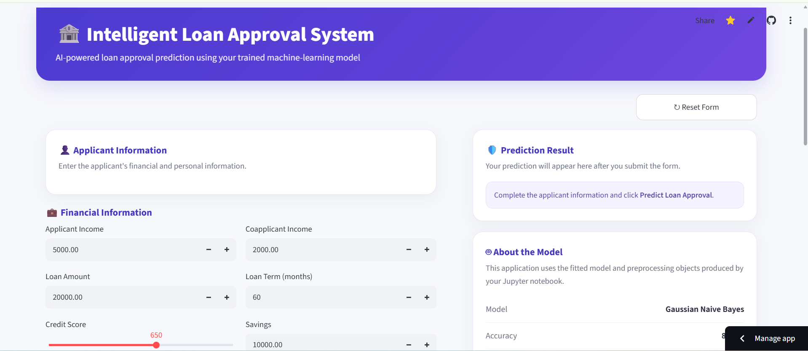
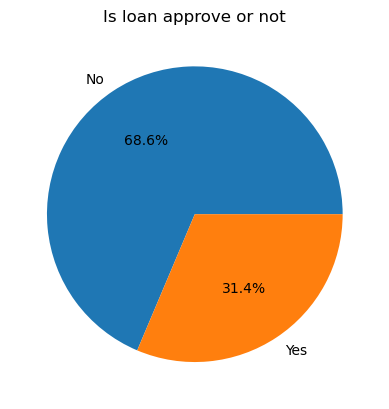
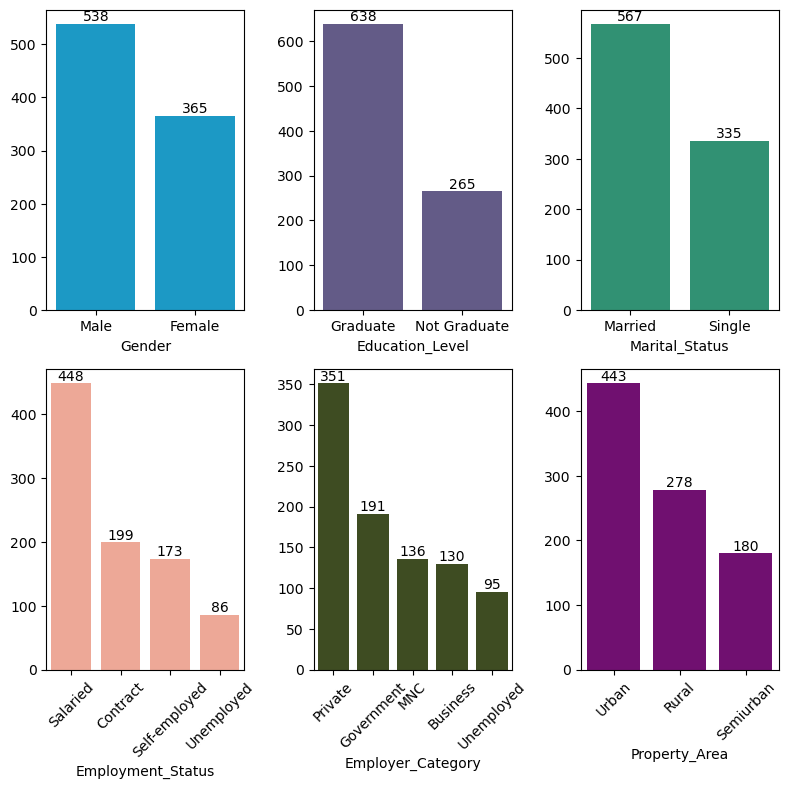
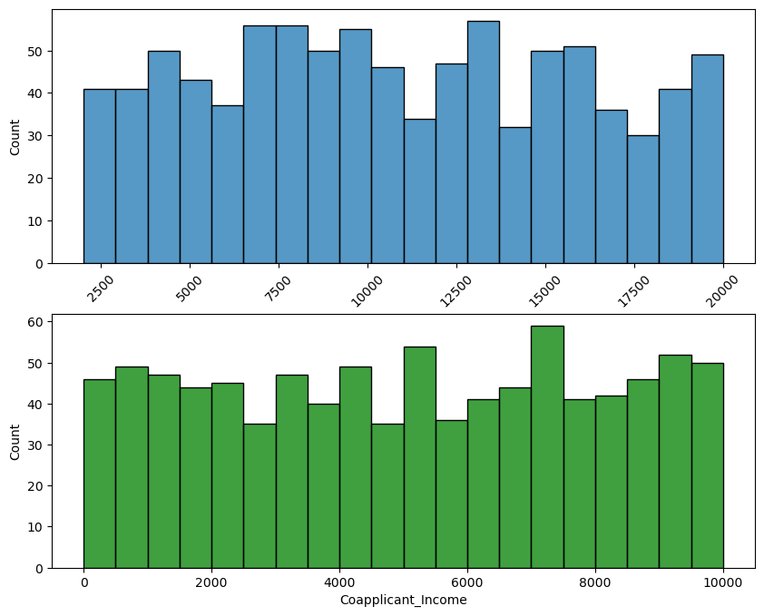
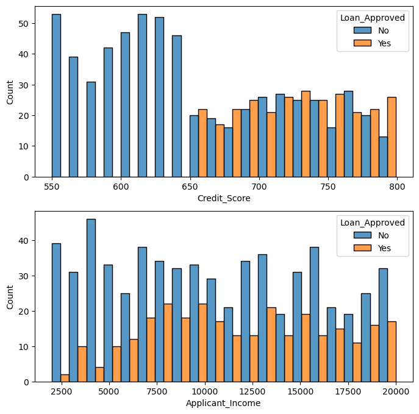
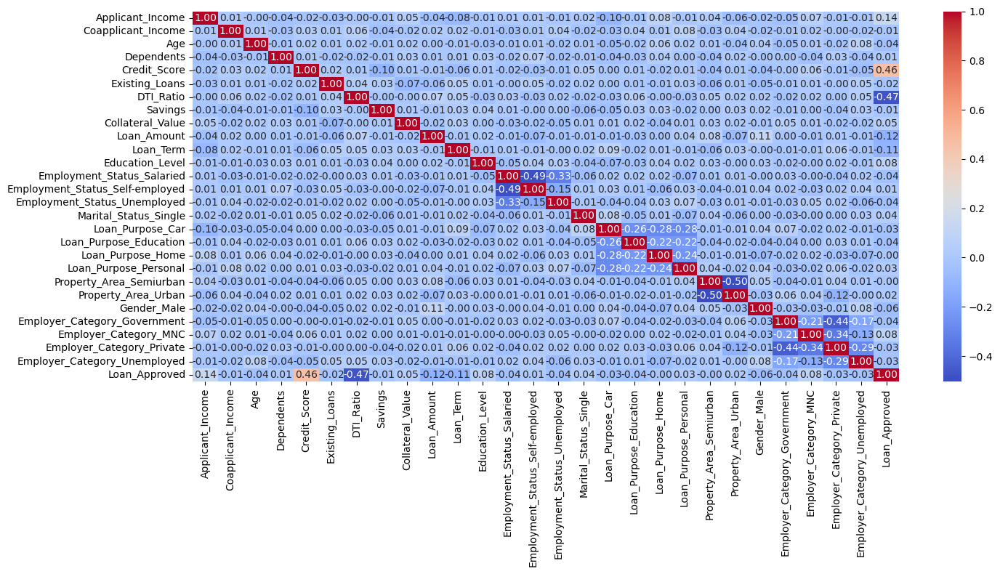
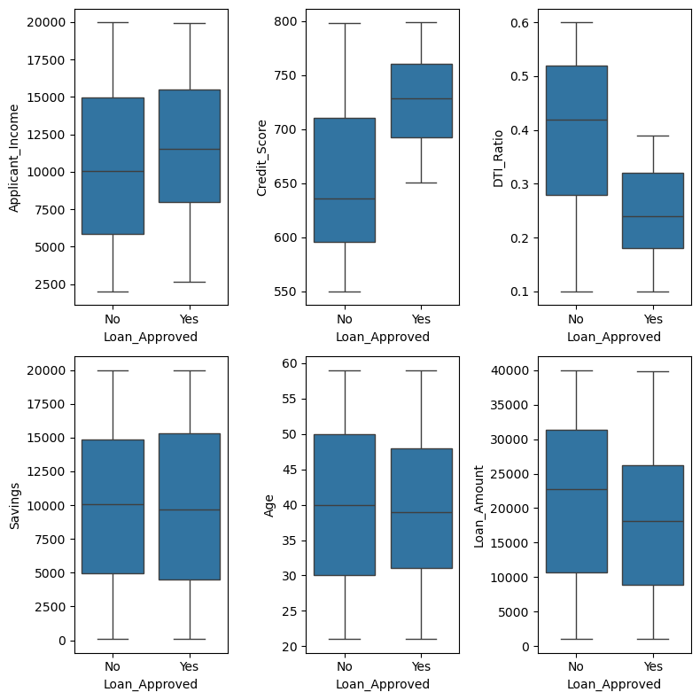
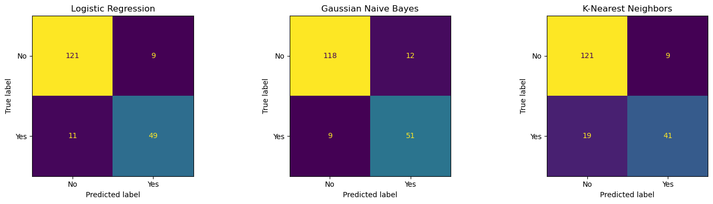

# 🏦 Intelligent Loan Approval System

An end-to-end **Machine Learning + Streamlit** project for predicting whether a loan application will be approved based on an applicant's financial, demographic, employment, and loan-related information.

The project covers the complete workflow from **data preprocessing and exploratory data analysis to model comparison and an interactive loan approval prediction dashboard**.

---

## 📌 Project Overview

Loan approval depends on multiple factors such as income, credit score, existing loans, debt-to-income ratio, savings, collateral, and applicant characteristics.

This project uses supervised machine learning to learn patterns from historical loan applications and predict the approval status of a new applicant.

### Project workflow

- Load and inspect the dataset
- Analyze and handle missing values
- Perform exploratory data analysis (EDA)
- Encode the target variable
- Split the data into training and testing sets
- Encode categorical features
- Perform correlation analysis
- Engineer additional features
- Scale numerical features
- Train multiple classification models
- Evaluate and compare model performance
- Visualize confusion matrices and EDA results
- Use the trained model in an interactive Streamlit application

> **Disclaimer:** This project is intended for learning, experimentation, and portfolio demonstration. A machine-learning prediction should not be used as the sole basis for a real-world lending decision.

---

# 🖥️ Interactive Streamlit Dashboard

The project includes an interactive web dashboard where users can enter applicant information and receive a loan approval prediction.

### Dashboard features

- Applicant information form
- Financial information inputs
- Credit score control
- Loan amount and loan-term inputs
- Prediction result panel
- Model information section
- Reset form functionality
- Real-time prediction using the trained machine-learning model

### Dashboard Preview

<p align="center">
  
</p>

---

# 📊 Dataset

The notebook loads the following dataset:

```text
loan_approval_data.csv
```

The original dataset contains **1,000 rows and 20 columns** before preprocessing.

Each column initially contains 950 non-null values, resulting in **50 missing values per column**.

## Features

| Feature | Description |
|---|---|
| `Applicant_ID` | Applicant identifier; removed before modeling |
| `Applicant_Income` | Applicant income |
| `Coapplicant_Income` | Coapplicant income |
| `Employment_Status` | Applicant employment status |
| `Age` | Applicant age |
| `Marital_Status` | Applicant marital status |
| `Dependents` | Number of dependents |
| `Credit_Score` | Applicant credit score |
| `Existing_Loans` | Number of existing loans |
| `DTI_Ratio` | Debt-to-income ratio |
| `Savings` | Applicant savings |
| `Collateral_Value` | Value of collateral |
| `Loan_Amount` | Requested loan amount |
| `Loan_Term` | Loan term |
| `Loan_Purpose` | Purpose of the loan |
| `Property_Area` | Property area/category |
| `Education_Level` | Applicant education level |
| `Gender` | Applicant gender |
| `Employer_Category` | Employer category |
| `Loan_Approved` | Target variable: `No` or `Yes` |

---

# 🧹 Data Preprocessing

## 1. Remove unnecessary column

`Applicant_ID` is removed because it is an identifier and is not useful as a predictive feature.

## 2. Handle missing target values

Rows where `Loan_Approved` is missing are removed.

After this step, the dataset contains **950 usable records**.

## 3. Target encoding

The target is converted from text to binary values:

```python
df["Loan_Approved"] = df["Loan_Approved"].map({
    "No": 0,
    "Yes": 1
}).astype(int)
```

| Original | Encoded |
|---|---:|
| `No` | `0` |
| `Yes` | `1` |

## 4. Train/test split

The dataset is split into:

- **80% training data**
- **20% testing data**
- `random_state=42`
- `stratify=y`

The stratified split preserves the class distribution between the training and testing sets.

## 5. Missing-value imputation

### Numerical features

Mean imputation is used:

```python
SimpleImputer(strategy="mean")
```

### Categorical features

Most-frequent imputation is used:

```python
SimpleImputer(strategy="most_frequent")
```

The imputers are fitted using the training data and then applied to the test data to help prevent data leakage.

## 6. Categorical feature encoding

`Education_Level` is ordinal encoded:

```text
Not Graduate → 0
Graduate     → 1
```

The following categorical features are one-hot encoded:

- `Employment_Status`
- `Marital_Status`
- `Loan_Purpose`
- `Property_Area`
- `Gender`
- `Employer_Category`

The encoder uses:

```python
OneHotEncoder(
    drop="first",
    sparse_output=False,
    handle_unknown="ignore",
    dtype=int
)
```

## 7. Feature engineering

Two squared features are created:

```python
Credit_Score_sq = Credit_Score ** 2
DTI_Ratio_sq = DTI_Ratio ** 2
```

These features allow the models to capture possible nonlinear relationships.

## 8. Feature scaling

`StandardScaler` is used to standardize the features:

```python
scaler = StandardScaler()

X_train_scaled = scaler.fit_transform(X_train)
X_test_scaled = scaler.transform(X_test)
```

The scaler is fitted only on the training data and then used to transform the test data.

---

# 🔍 Exploratory Data Analysis

The project includes several EDA and model-evaluation visualizations:

- Loan approval class distribution
- Categorical feature analysis
- Applicant and coapplicant income distributions
- Outlier analysis
- Credit score distribution by approval status
- Applicant income distribution by approval status
- Correlation heatmap
- Model confusion matrices

## Target Distribution

After removing rows with missing target values:

| Loan Approval | Count |
|---|---:|
| No | 652 |
| Yes | 298 |
| **Total** | **950** |

The target distribution is therefore not perfectly balanced, making metrics such as **precision, recall, F1-score, and ROC-AUC** useful alongside accuracy.

---

# 📈 Project Visualizations

All major project visualizations are available in the `readme_images/` directory.

## Loan Approval Distribution

Shows the distribution of approved and rejected loan applications.

<p align="center">
  
</p>

## Categorical Feature Analysis

Summarizes the main categorical variables in the dataset.

<p align="center">
  
</p>

## Income Distribution

Shows applicant and coapplicant income distributions.

<p align="center">
  
</p>

## Credit Score and Income by Approval

Compares credit score and applicant income across loan approval classes.

<p align="center">
  
</p>

## Correlation Heatmap

Displays relationships among the numerical features and the loan approval target.

<p align="center">
  
</p>

## Outlier Analysis

Uses box plots to inspect potential outliers in important numerical variables.

<p align="center">
  
</p>

## Model Confusion Matrices

Visualizes correct and incorrect predictions for the trained classification models.

<p align="center">
  
</p>

---

# 🤖 Machine Learning Models

Three classification approaches are trained and evaluated.

## 1. Logistic Regression

```python
LogisticRegression(
    max_iter=1000,
    random_state=42
)
```

## 2. Gaussian Naive Bayes

```python
GaussianNB()
```

## 3. K-Nearest Neighbors

KNN is tuned using `GridSearchCV` with:

```python
n_neighbors = [3, 5, 7, 9]
```

Five-fold cross-validation is used, with **precision** as the grid-search scoring metric.

---

# 📊 Model Evaluation

The models are evaluated using:

- Accuracy
- Precision
- Recall
- F1-score
- ROC-AUC
- Confusion matrix
- Classification report

## Test Set Results

| Model | Accuracy | Precision | Recall | F1 | ROC-AUC |
|---|---:|---:|---:|---:|---:|
| **Logistic Regression** | **0.895** | 0.845 | 0.817 | 0.831 | 0.941 |
| **Gaussian Naive Bayes** | 0.889 | 0.810 | **0.850** | 0.829 | **0.952** |
| **K-Nearest Neighbors** | 0.853 | 0.820 | 0.683 | 0.745 | 0.900 |

## Classification Summary

### Logistic Regression

- Accuracy: **89%**
- Precision for approved loans: **0.84**
- Recall for approved loans: **0.82**
- F1-score for approved loans: **0.83**

### Gaussian Naive Bayes

- Accuracy: **89%**
- Precision for approved loans: **0.81**
- Recall for approved loans: **0.85**
- F1-score for approved loans: **0.83**

### K-Nearest Neighbors

- Accuracy: **85%**
- Precision for approved loans: **0.82**
- Recall for approved loans: **0.68**
- F1-score for approved loans: **0.75**

---

# 🏆 Model Comparison

Based on the reported test results:

| Observation | Best Model |
|---|---|
| Highest Accuracy | **Logistic Regression — 0.895** |
| Highest Precision | **Logistic Regression — 0.845** |
| Highest Recall | **Gaussian Naive Bayes — 0.850** |
| Highest F1-score | **Logistic Regression — 0.831** |
| Highest ROC-AUC | **Gaussian Naive Bayes — 0.952** |

### Current Streamlit model

The interactive Streamlit dashboard uses the **Gaussian Naive Bayes** model.

This choice is consistent with the model's strong **ROC-AUC (0.952)** and **recall (0.850)** for the approved-loan class.

The best model ultimately depends on the application's business objective. For example, recall may be important when minimizing missed genuinely approvable applications, while ROC-AUC is useful for evaluating overall ranking/discrimination.

---

# 🔄 Project Workflow

```text
Raw Loan Data
      │
      ▼
Initial Data Inspection
      │
      ▼
Remove Applicant_ID
      │
      ▼
Remove Rows with Missing Target
      │
      ▼
Exploratory Data Analysis
      │
      ▼
Encode Target
      │
      ▼
Train/Test Split (80/20)
      │
      ▼
Missing-Value Imputation
      │
      ▼
Categorical Encoding
      │
      ▼
Correlation Analysis
      │
      ▼
Feature Engineering
      │
      ▼
Feature Scaling
      │
      ▼
Train Models
      │
      ├── Logistic Regression
      ├── Gaussian Naive Bayes
      └── KNN + GridSearchCV
      │
      ▼
Evaluate Models
      │
      ▼
Compare Performance
      │
      ▼
Streamlit Prediction Dashboard
```

---

# 🖥️ Streamlit Application Workflow

The deployed application follows this simplified pipeline:

```text
User Input
    │
    ▼
Input Validation
    │
    ▼
Saved Preprocessing Objects
    │
    ▼
Feature Transformation
    │
    ▼
Trained Gaussian Naive Bayes Model
    │
    ▼
Loan Approval Prediction
    │
    ▼
Prediction Result
```

The application uses the trained model and preprocessing objects generated during model development so that dashboard inputs are transformed consistently with the training pipeline.

---

# 🛠️ Technologies Used

| Technology | Purpose |
|---|---|
| **Python** | Core programming language |
| **NumPy** | Numerical computation |
| **Pandas** | Data manipulation and analysis |
| **Matplotlib** | Data visualization |
| **Seaborn** | Statistical visualization |
| **Scikit-learn** | Preprocessing, training, tuning, and evaluation |
| **Jupyter Notebook** | ML development and experimentation |
| **Streamlit** | Interactive web application |
| **Pickle / Joblib** | Model and preprocessing object persistence |

---

# 📚 Python Libraries

```python
import numpy as np
import pandas as pd
import seaborn as sns
import matplotlib.pyplot as plt

from sklearn.model_selection import train_test_split, GridSearchCV
from sklearn.impute import SimpleImputer
from sklearn.preprocessing import (
    OrdinalEncoder,
    OneHotEncoder,
    StandardScaler
)

from sklearn.linear_model import LogisticRegression
from sklearn.naive_bayes import GaussianNB
from sklearn.neighbors import KNeighborsClassifier

from sklearn.metrics import (
    accuracy_score,
    precision_score,
    recall_score,
    f1_score,
    classification_report,
    confusion_matrix,
    ConfusionMatrixDisplay,
    roc_auc_score
)
```

---

# 📁 Project Structure

A practical project structure for the current workflow is:

```text
Intelligent-Loan-Approval-System/
│
├── Intelligent_Loan_Approval_System.ipynb
├── loan_approval_data.csv
├── app.py
├── requirements.txt
├── README.md
│
├── readme_images/
│   ├── dashboard.png
│   ├── categorical_eda.png
│   ├── correlation_heatmap.png
│   ├── credit_income_by_approval.png
│   ├── income_distribution.png
│   ├── loan_approval_distribution.png
│   ├── model_confusion_matrices.png
│   └── outlier_analysis.png
│
└── model/
    └── ... trained model / preprocessing artifacts
```

> Keep the filenames in this section synchronized with the actual repository structure.

---

# ⚙️ How to Run

## 1. Clone the repository

```bash
git clone https://github.com/MehediNoorNeo/Intelligent-Loan-Approval-System.git
cd Intelligent-Loan-Approval-System
```

## 2. Install dependencies

```bash
pip install -r requirements.txt
```

If `requirements.txt` is not available, the main packages can be installed with:

```bash
pip install numpy pandas matplotlib seaborn scikit-learn streamlit joblib
```

## 3. Run the Jupyter Notebook

```bash
jupyter notebook
```

Open:

```text
Intelligent_Loan_Approval_System.ipynb
```

Make sure the dataset is available:

```text
loan_approval_data.csv
```

Then run the notebook cells from top to bottom to reproduce the preprocessing, EDA, model training, and evaluation workflow.

## 4. Run the Streamlit Dashboard

```bash
streamlit run app.py
```

Open the local Streamlit URL shown in the terminal, typically:

```text
http://localhost:8501
```

---

# 💾 Model Persistence

The trained model and preprocessing objects can be saved and loaded so the Streamlit application does not need to retrain the model on every startup.

Conceptually:

```text
Jupyter Notebook
      │
      ├── Preprocess data
      ├── Train model
      └── Save artifacts
              │
              ▼
       Model / Preprocessor
              │
              ▼
       Streamlit Application
              │
              ▼
        Load artifacts
              │
              ▼
        Make Prediction
```

---

# 🔐 Responsible Use

Loan approval is a high-impact decision. A production system should include additional safeguards such as:

- Data privacy and secure storage
- Fairness and bias evaluation
- Explainability and auditability
- Regulatory compliance
- Human review
- Robust input validation
- Monitoring for model drift and changing data patterns

The model output should therefore be treated as a **decision-support signal**, not an automatic final lending decision.

---

# 🔮 Future Improvements

Possible extensions include:

- Add prediction probability/confidence to the dashboard
- Add ROC curves for all models
- Add precision-recall curves
- Perform cross-validation comparison across all models
- Tune Logistic Regression and Gaussian Naive Bayes
- Add more extensive KNN hyperparameter tuning
- Add feature importance and model interpretability
- Add SHAP-based explanations
- Optimize the decision threshold based on lending costs
- Add stronger input validation and user-friendly error messages
- Add automated tests for preprocessing and prediction
- Add an API for model serving
- Add authentication and secure applicant-data handling
- Deploy the Streamlit application to a cloud platform

---

# 🎯 Key Takeaways

1. The project demonstrates a complete supervised machine-learning workflow for binary loan approval classification.
2. Missing values are handled separately for numerical and categorical features.
3. Categorical variables are encoded using ordinal and one-hot encoding.
4. Feature engineering adds squared terms for `Credit_Score` and `DTI_Ratio`.
5. Three classification models are compared using multiple evaluation metrics.
6. **Logistic Regression** achieves the highest test accuracy (**0.895**).
7. **Gaussian Naive Bayes** achieves the highest ROC-AUC (**0.952**) and recall (**0.850**) for approved loans.
8. The **Streamlit dashboard currently uses Gaussian Naive Bayes** for interactive predictions.
9. The project demonstrates the transition from notebook-based experimentation to an interactive machine-learning application.

---

# 👨‍💻 Author

**Mehedi Hasan**

---

## ⭐ If you find this project useful

Consider giving the repository a ⭐ on GitHub.

